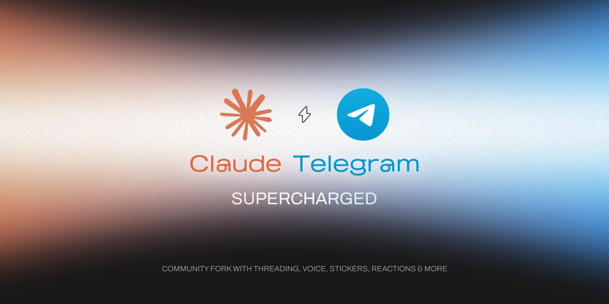

<div align="center">



<h3>Community fork of Claude Code's Telegram plugin with threading, voice, stickers, reactions, and more.</h3>

<br />

<a href="https://github.com/k1p1l0/claude-telegram-supercharged/blob/main/LICENSE"></a>
<a href="https://github.com/k1p1l0/claude-telegram-supercharged/stargazers"></a>
<a href="https://github.com/k1p1l0/claude-telegram-supercharged/commits/main"></a>

<br />

<a href="#getting-started">Getting Started</a>
<span>&nbsp;&nbsp;&bull;&nbsp;&nbsp;</span>
<a href="#features">Features</a>
<span>&nbsp;&nbsp;&bull;&nbsp;&nbsp;</span>
<a href="#tools-exposed-to-the-assistant">Tools Reference</a>
<span>&nbsp;&nbsp;&bull;&nbsp;&nbsp;</span>
<a href="#contributing">Contributing</a>

<br />
<hr />
</div>

## What is Claude Telegram Supercharged?

**Claude Telegram Supercharged** is a community-driven, drop-in replacement for Anthropic's official Claude Code Telegram plugin. It takes everything the official plugin does and adds the features the community needs right now -- threading, MarkdownV2 formatting, voice messages, stickers, inline buttons, emoji reactions, and more.

Anthropic's Claude Code Channels is an amazing product with huge potential. But Anthropic has a lot on their plate, and the official plugin ships the essentials. Instead of filing issues and waiting, we ship fixes and features ourselves -- for ourselves and for the entire community.

## Table of Contents

- [What is Claude Telegram Supercharged?](#what-is-claude-telegram-supercharged)
- [Getting Started](#getting-started)
- [Features](#features)
- [Tools Exposed to the Assistant](#tools-exposed-to-the-assistant)
- [Photos](#photos)
- [Voice & Audio Messages](#voice--audio-messages)
- [Group Chats & Conversation Threading](#group-chats--conversation-threading)
- [Access Control](#access-control)
- [Message History](#message-history-buffer)
- [Limitations](#limitations)
- [Roadmap](#roadmap)
- [Feature Details](#feature-details)
- [Contributing](#contributing)
- [Credits](#credits)
- [License](#license)

## Getting Started

> Default pairing flow for a single-user DM bot. See [ACCESS.md](./ACCESS.md) for groups and multi-user setups.

### Prerequisites

- [Bun](https://bun.sh) -- the MCP server runs on Bun. Install with `curl -fsSL https://bun.sh/install | bash`.

### 1. Create a bot with BotFather

Open a chat with [@BotFather](https://t.me/BotFather) on Telegram and send `/newbot`. BotFather asks for two things:

- **Name** -- the display name shown in chat headers (anything, can contain spaces)
- **Username** -- a unique handle ending in `bot` (e.g. `my_assistant_bot`). This becomes your bot's link: `t.me/my_assistant_bot`.

BotFather replies with a token that looks like `123456789:AAHfiqksKZ8...` -- that's the whole token, copy it including the leading number and colon.

### 2. Install the [official plugin](https://github.com/anthropics/claude-plugins-official/tree/main/external_plugins/telegram)

These are Claude Code commands -- run `claude` to start a session first.

```
/plugin install telegram@claude-plugins-official
```

### 3. Apply the supercharged version

Clone this repo and replace the official plugin's server with the supercharged one:

```sh
git clone https://github.com/k1p1l0/claude-telegram-supercharged.git
cp claude-telegram-supercharged/server.ts ~/.claude/plugins/cache/claude-plugins-official/telegram/0.0.1/server.ts
```

### 4. Give the server the token

```
/telegram:configure 123456789:AAHfiqksKZ8...
```

Writes `TELEGRAM_BOT_TOKEN=...` to `~/.claude/channels/telegram/.env`. You can also write that file by hand, or set the variable in your shell environment -- shell takes precedence.

### 5. Relaunch with the channel flag

The server won't connect without this -- exit your session and start a new one:

```sh
claude --channels plugin:telegram@claude-plugins-official
```

### 6. Pair

With Claude Code running from the previous step, DM your bot on Telegram -- it replies with a 6-character pairing code. If the bot doesn't respond, make sure your session is running with `--channels`. In your Claude Code session:

```
/telegram:access pair <code>
```

Your next DM reaches the assistant.

> Unlike Discord, there's no server invite step -- Telegram bots accept DMs immediately. Pairing handles the user-ID lookup so you never touch numeric IDs.

### 7. Lock it down

Pairing is for capturing IDs. Once you're in, switch to `allowlist` so strangers don't get pairing-code replies. Ask Claude to do it, or `/telegram:access policy allowlist` directly.

### Updating

When the official plugin updates, re-apply the supercharged server:

```sh
cd claude-telegram-supercharged
git pull
cp server.ts ~/.claude/plugins/cache/claude-plugins-official/telegram/0.0.1/server.ts
```

Then restart your Claude Code session.

## Features

| Feature | Description |
| --- | --- |
| **MarkdownV2 Formatting** | Bold, italic, code, and links render properly in Telegram instead of showing raw characters |
| **Conversation Threading** | Smart thread management for group chats with reply context, chain tracking, and Forum topic support |
| **Voice & Audio Messages** | Receive voice messages and audio files with automatic whisper transcription built into the server |
| **Sticker & GIF Support** | Static stickers passed as images; animated stickers and GIFs converted to multi-frame collages |
| **Ask User (Inline Buttons)** | Send questions with tappable inline keyboard buttons and wait for the user's choice |
| **Emoji Reaction Tracking** | Claude receives and acts on user reactions as lightweight feedback |
| **Reaction Status Indicators** | Visual processing status via emoji reactions (read / working / done) |
| **Emoji Reaction Validation** | Client-side whitelist prevents cryptic `REACTION_INVALID` errors |
| **Group Pairing** | Add your bot to a group, send a message, get a pairing code -- no need to hunt for numeric chat IDs |
| **Message History** | SQLite-backed rolling message store -- Claude has context across restarts, can search and retrieve past messages |

## Tools Exposed to the Assistant

| Tool | Purpose |
| --- | --- |
| `reply` | Send to a chat. Takes `chat_id` + `text`, optionally `reply_to` (message ID) for native threading, `files` (absolute paths) for attachments, and `parse_mode` (MarkdownV2/HTML/plain, defaults to MarkdownV2). Images (`.jpg`/`.png`/`.gif`/`.webp`) send as photos with inline preview; other types send as documents. Max 50MB each. Auto-chunks text; files send as separate messages after the text. Returns the sent message ID(s). |
| `react` | Add an emoji reaction to a message by ID. **Only Telegram's fixed whitelist** is accepted (👍 👎 ❤ 🔥 👀 🎉 😂 🤔 etc). Also used for status indicators (👀 read → 👍 done). |
| `edit_message` | Edit a message the bot previously sent. Supports `parse_mode` (MarkdownV2/HTML/plain). Useful for "working..." → result progress updates. Only works on the bot's own messages. |
| `ask_user` | Send a question with inline keyboard buttons and wait for the user's choice. Takes `chat_id`, `text`, `buttons` (array of labels), optional `parse_mode` and `timeout` (default 120s). Returns the label of the tapped button. |
| `get_history` | Retrieve recent message history from a chat. Takes `chat_id`, optional `limit` (default 50, max 200), optional `before` (unix timestamp for pagination). Returns formatted messages with timestamps, senders, and content. |
| `search_messages` | Search message history by text pattern. Takes `chat_id`, `query` (substring match), optional `limit` (default 20, max 100). Returns matching messages. |

### Inbound Events

| Event | Description |
| --- | --- |
| Text message | Forwarded to Claude as a channel notification with `chat_id`, `message_id`, `user`, `ts`. |
| Photo | Downloaded to inbox, path included in notification so Claude can `Read` it. |
| Emoji reaction | When a user reacts to a bot message, Claude receives a notification with `event_type: "reaction"`, the emoji, and the `message_id`. Use as lightweight feedback. |
| Voice message | Downloaded to inbox as `.ogg`, auto-transcribed by the server if whisper is installed. Transcription replaces "(voice message)" in the notification text. Audio path still included as `audio_path`. |
| Audio file | Forwarded audio files (`.mp3`, etc.) downloaded to inbox, path included as `audio_path`. |
| Sticker | Static `.webp` passed directly as `image_path`. Animated (`.tgs`) and video (`.webm`) stickers converted to multi-frame collage. Emoji and pack name included in text. |
| GIF / Animation | Downloaded and converted to a multi-frame horizontal collage so Claude can see the animation content. |

Inbound messages trigger a typing indicator automatically -- Telegram shows "botname is typing..." while the assistant works on a response.

## Photos

Inbound photos are downloaded to `~/.claude/channels/telegram/inbox/` and the local path is included in the `<channel>` notification so the assistant can `Read` it. Telegram compresses photos -- if you need the original file, send it as a document instead (long-press → Send as File).

## Voice & Audio Messages

Voice messages and audio files are downloaded to `~/.claude/channels/telegram/inbox/` and automatically transcribed by the server. The transcription text replaces "(voice message)" in the notification, so Claude receives the spoken text directly.

### Transcription Setup

The server auto-detects which whisper binary is available (checked once at startup):

1. **[whisper.cpp](https://github.com/ggml-org/whisper.cpp)** (recommended) -- `brew install whisper-cpp`. Fast C++ port, runs fully offline. Requires a model file:
   ```sh
   # Download the small multilingual model (465MB, good quality/speed balance)
   mkdir -p /usr/local/share/whisper-cpp/models
   curl -L -o /usr/local/share/whisper-cpp/models/ggml-small.bin \
     "https://huggingface.co/ggerganov/whisper.cpp/resolve/main/ggml-small.bin"
   ```
2. **[openai-whisper](https://github.com/openai/whisper)** (fallback) -- `pip install openai-whisper`. Python-based, slower but also works offline.
3. **No whisper** -- voice messages are still downloaded and the `audio_path` is included in the notification, but no transcription is provided. Claude will suggest installing whisper.

Both options require **ffmpeg** (`brew install ffmpeg`) for audio format conversion.

### Auto-transcription in history

When `autoTranscribe` is enabled (the default), the server transcribes **all** voice/audio messages in group chats -- even ones that don't mention the bot. This means `get_history` and the auto-injected context always show the spoken text (prefixed with 🎤) instead of `[voice]`. Claude gets full conversational context including what people said in voice messages.

To disable (e.g. to save CPU on busy groups):

```sh
/telegram:access set autoTranscribe false
```

To re-enable:

```sh
/telegram:access set autoTranscribe true
```

## Group Chats & Conversation Threading

The plugin supports group chats with smart conversation threading -- Claude can follow reply chains, see who said what, and respond in the correct thread.

### Setup

**1. Disable privacy mode in BotFather**

By default, Telegram bots in groups only see commands and messages that mention them. For full thread tracking, disable privacy mode:

1. Open [@BotFather](https://t.me/BotFather) on Telegram
2. Send `/mybots` → select your bot
3. **Bot Settings** → **Group Privacy** → **Turn off**

> If you prefer to keep privacy mode on, the bot will still work -- it just won't see messages that don't mention it, so thread tracking will be incomplete.

**2. Add the bot to a group**

Add your bot to any Telegram group like a normal member.

**3. Pair the group (automatic)**

Just send a message in the group mentioning your bot (e.g. `@your_bot hello`). The bot replies with a 6-character pairing code -- same flow as DM pairing:

```
/telegram:access pair <code>
```

That's it. The group is registered automatically with `requireMention: true` (bot only responds when mentioned or replied to).

To let it respond to all messages:

```
/telegram:access group update -100XXXXXXXXXX requireMention false
```

> **Manual alternative:** If you already know the group's numeric ID (starts with `-100...`), you can register directly with `/telegram:access group add -100XXXXXXXXXX`. Ways to find the ID: check the bot's stderr logs, open [web.telegram.org](https://web.telegram.org) (ID is in the URL), or forward a group message to [@RawDataBot](https://t.me/RawDataBot).

**4. Restart Claude Code**

```sh
claude --channels plugin:telegram@claude-plugins-official
```

### How Threading Works

- When someone replies to a message in the group, Claude receives `reply_to_text` and `reply_to_user` showing what was replied to
- The plugin tracks up to 200 messages per chat (4-hour TTL) and walks reply chains up to 3 levels deep, providing `thread_context` in the notification
- Claude's own sent messages are tracked too, so reply chains work end-to-end
- Claude automatically threads its responses to the message that triggered them

### Forum Topics

If your supergroup has **Topics** enabled, the plugin forwards `thread_id` (Telegram's `message_thread_id`) and passes it through to replies -- keeping conversations in their correct Forum topic automatically.

## Access Control

Full access control docs in [ACCESS.md](./ACCESS.md) -- DM policies, groups, mention detection, delivery config, skill commands, and the `access.json` schema.

Quick reference: Default policy is `pairing` -- DMs and groups both use the pairing flow. For DMs, message the bot to get a code. For groups, add the bot and mention it to get a code. Then `/telegram:access pair <code>` approves either. `ackReaction` only accepts Telegram's fixed emoji whitelist.

## Message History Buffer

Every message flowing through the bot is captured in a local SQLite database and persisted across restarts. Claude gets context without asking users to repeat themselves.

```
~/.claude/channels/telegram/data/messages.db
```

**How it works:**
- A grammY middleware intercepts ALL messages (including group messages without @bot mention) before the gate check
- Both inbound messages and bot replies are stored with `INSERT OR REPLACE` dedup
- Last 5 messages are auto-injected into each notification so Claude always has rolling context
- `get_history` retrieves up to 200 messages with pagination; `search_messages` does substring search
- SQLite WAL mode ensures crash-safe writes -- if Claude Code crashes, the DB auto-recovers on next startup
- Rolling buffer prunes automatically: 500 messages/chat cap, 14-day TTL, 50MB hard limit

## Limitations

Telegram's Bot API exposes **no native history endpoint** -- bots only see messages in real-time. We solve this with a local SQLite message store (see [Message History](#message-history-buffer) below). Every message flowing through the bot is captured and persisted, giving Claude full context across restarts via `get_history` and `search_messages` tools. History is available from when the bot joined the chat.

Photos and voice messages are downloaded eagerly on arrival -- there's no way to fetch attachments from historical messages via the Bot API.

## Roadmap

### Completed

- [x] MarkdownV2 formatting
- [x] Emoji reaction tracking
- [x] Ask User inline buttons
- [x] Reaction status indicators (👀 → 🔥 → 👍)
- [x] Voice & audio messages
- [x] Sticker & GIF support
- [x] Emoji reaction validation
- [x] Conversation threading
- [x] Group pairing flow (no manual chat ID lookup needed)
- [x] Message history buffer (SQLite, rolling store, `get_history` + `search_messages` tools)

### Planned
- [ ] **Daemon mode wrapper** -- tmux + systemd auto-reconnect for always-on operation
- [ ] **Remote permission approval** -- Approve Claude Code permission prompts via Telegram inline buttons
- [ ] **Scheduled messages** -- Send messages at a specific time
- [ ] **Multi-bot support** -- Run multiple bots from one server instance
- [ ] **Rate limiting & usage stats** -- Track token usage and set limits per user
- [ ] **Webhook mode** -- Alternative to polling for production deployments
- [ ] **Custom commands** -- Define bot commands that map to Claude Code skills

---

## Feature Details

<details>
<summary><strong>MarkdownV2 formatting support</strong></summary>

<br />

The official plugin sends all messages as plain text. `*bold*` and `_italic_` show up as raw characters in Telegram. We fixed that.

- Added `parse_mode` parameter to `reply` and `edit_message` tools
- Defaults to `MarkdownV2` so messages render with proper Telegram formatting
- Supports `HTML` and `plain` modes as fallback
- Updated MCP instructions so Claude knows how to use Telegram's formatting syntax

> Related issue: [anthropics/claude-code#36622](https://github.com/anthropics/claude-code/issues/36622)

</details>

<details>
<summary><strong>Emoji reaction tracking</strong></summary>

<br />

The official plugin ignores user reactions entirely. Now when you react to a bot message with an emoji (e.g. 👍, 👎, 🔥), Claude receives a notification and can act on it.

- Reactions from allowlisted users are forwarded to Claude as channel events
- Claude sees which emoji was used and on which message
- Use reactions as lightweight feedback: 👍 = approve, 👎 = reject, 🔥 = great job

</details>

<details>
<summary><strong>Ask User (inline keyboard buttons)</strong></summary>

<br />

A new `ask_user` tool -- the Telegram equivalent of Claude Code's `AskUserQuestion`. Claude sends a message with tappable inline buttons and waits for the user's choice.

- Send a question with up to 10 button options
- Blocks until the user taps a button (or timeout after 120s)
- Buttons are removed after selection, showing a ✅ confirmation
- Perfect for confirmations ("Deploy?" → Yes / No), choices, and approval flows

</details>

<details>
<summary><strong>Reaction-based status indicators</strong></summary>

<br />

Claude now reacts to your messages with emoji to show processing status -- like read receipts on steroids.

- 👀 immediately when Claude reads your message
- 🔥 when starting heavy work (research, code generation, multi-step tasks)
- 👍 when Claude has finished and sent its reply
- Each reaction replaces the previous one -- Telegram only keeps one bot reaction per message
- Uses only Telegram's whitelisted bot emoji (👍 👎 ❤ 🔥 👀 🎉 😂 🤔)

Beyond status, Claude also reacts expressively when a message genuinely stands out -- 🔥 for impressive work, 😂 for funny messages, ❤ for heartfelt ones, 🎉 for celebrations. Selective, not robotic.

</details>

<details>
<summary><strong>Voice & audio message support</strong></summary>

<br />

Send a voice message or audio file in Telegram and Claude receives the transcription directly. The server handles transcription automatically — no shell commands needed from Claude.

- Supports both voice messages (recorded in-app, `.ogg`) and audio files (forwarded `.mp3`, etc.)
- Downloaded eagerly to `~/.claude/channels/telegram/inbox/` like photos
- **Auto-transcription**: server detects `whisper-cli` (whisper.cpp) or `whisper` (openai-whisper) at startup and transcribes every voice/audio message
- Transcription text replaces "(voice message)" in the notification content — Claude gets spoken text, not just a file path
- Audio path still included as `audio_path` in metadata for further processing if needed
- Language auto-detected (supports 99 languages via whisper models)
- Graceful fallback: if no whisper is installed, the audio file is still delivered without transcription

</details>

<details>
<summary><strong>Sticker & GIF support</strong></summary>

<br />

Send a sticker or GIF in Telegram and Claude actually sees it. Static stickers are passed directly as images. Animated stickers and GIFs are converted to multi-frame collages so Claude can understand the visual content.

- **Static stickers** (`.webp`) -- passed directly to Claude as `image_path`
- **Animated stickers** (`.tgs`, `.webm`) -- extracted into a 4-frame collage at 640px per frame
- **GIFs / animations** -- Telegram sends these as `.mp4`; 4 frames are extracted and stitched into a horizontal strip
- Sticker emoji and pack name are included in the notification text for extra context
- Uses `ffmpeg` for frame extraction and collage stitching -- falls back gracefully if unavailable

</details>

<details>
<summary><strong>Conversation threading for group chats</strong></summary>

<br />

In group chats, multiple conversations happen simultaneously. Without threading, Claude sees a flat stream of messages with no context. Now it can follow and participate in threaded conversations.

- **Reply context forwarding** -- when someone replies to a message, Claude sees the original text and sender (`reply_to_text`, `reply_to_user`)
- **Thread chain tracking** -- in-memory tracker maintains up to 200 messages per chat (4-hour TTL), walking reply chains up to 3 levels deep
- **Auto-threaded replies** -- Claude's responses include the thread context so it can reply to the correct message
- **Forum topic support** -- Telegram supergroup topics (`message_thread_id`) are forwarded as `thread_id` and passed through to replies, keeping conversations in their correct topic
- **Bot message tracking** -- bot's own sent messages are tracked so reply chains work when users reply to the bot
- Zero persistence needed -- in-memory only, bounded and self-pruning

</details>

<details>
<summary><strong>Message history buffer</strong></summary>

<br />

Telegram Bot API has no history endpoint. Bots only see messages in real-time. Close the laptop = messages lost. Restart Claude Code = context gone. We solved this with a 3-tier approach -- Tier 1 ships now with zero extra infra.

### The Problem

The official plugin is stateless -- Claude only sees messages as they arrive. Restart Claude Code and all context is gone.

### Tier 1: Real-time Capture (Shipped)

| Aspect | Detail |
| --- | --- |
| **Storage** | `bun:sqlite` (built into Bun, 3-6x faster than better-sqlite3, 80K inserts/sec) |
| **Schema** | `messages` table with `UNIQUE(chat_id, message_id)`, indexed on `(chat_id, date DESC)` |
| **Buffer** | Hybrid: 500 messages/chat + 14-day TTL + 50MB hard limit |
| **Pruning** | Batch every 100 inserts, not per-insert triggers |
| **Context injection** | Auto-inject last 5 messages with each notification (~800 tokens) |
| **New MCP tools** | `get_history(chat_id, limit)` + `search_messages(chat_id, query)` |
| **DB location** | `~/.claude/channels/telegram/data/messages.db` |
| **Crash recovery** | Automatic via SQLite WAL -- the DB IS the recovery mechanism |
| **Group capture** | grammY middleware captures ALL group messages, even without @bot mention |
| **History depth** | From when the bot joined the chat |

### Tier 2: History Backfill (Planned -- needs a user account)

| Aspect | Detail |
| --- | --- |
| **Library** | GramJS (JS/TS, same ecosystem as our plugin) |
| **Auth** | Dedicated phone number -> StringSession (one-time interactive setup) |
| **API** | `messages.getHistory` -- 100 messages/request, ~7,500 messages/minute |
| **Architecture** | Parallel process writes to same SQLite DB, dedup via `UNIQUE(chat_id, message_id)` |
| **History depth** | Complete -- all messages ever sent in the chat |

### Tier 3: Always-On Daemon (Planned)

| Approach | Detail |
| --- | --- |
| **tmux + systemd on VPS** | Most battle-tested pattern for always-on bots |
| **Permissions** | Use `allowedTools` in settings.json, NOT `--dangerously-skip-permissions` |
| **Remote approval** | Telegram inline buttons for Allow/Deny on permission prompts |
| **Message buffering** | Telegram buffers offline bot messages for 24h; store last `update_id` persistently |

</details>

<details>
<summary><strong>Group pairing flow</strong></summary>

<br />

The official plugin requires you to manually find your group's numeric chat ID (a `-100...` number) using external bots or API calls. We added automatic pairing -- the same flow as DM pairing, but for groups.

- Add your bot to a group and send a message mentioning it
- The bot replies with a 6-character pairing code in the group chat
- Run `/telegram:access pair <code>` in your Claude Code session
- The group is automatically registered with `requireMention: true` and open `allowFrom`
- No need to hunt for numeric IDs, use external bots, or read API responses
- The pending entry includes a `type: "group"` discriminator so the pair command knows to add to `groups` instead of `allowFrom`

</details>

<details>
<summary><strong>Emoji reaction validation</strong></summary>

<br />

The official plugin passes any emoji to Telegram's `setMessageReaction` API, which silently rejects non-whitelisted emoji with a cryptic `REACTION_INVALID` error. We added client-side validation.

- Full whitelist of 70+ Telegram-allowed reaction emoji built into the plugin
- Invalid emoji are caught before the API call with a helpful error message listing valid options
- Tool description updated with the complete emoji list so Claude picks valid reactions from the start

</details>

## Contributing

This is a community project. We want your help!

1. Fork the repo
2. Create a feature branch (`git checkout -b feature/voice-transcription`)
3. Make your changes
4. Test with a real Telegram bot
5. Open a PR with a clear description of what you changed and why

### Guidelines

- Keep changes focused -- one feature per PR
- Test with real Telegram interactions, not just unit tests
- Update the README if you add new features or tools
- Follow the existing code style (TypeScript, grammy library)

## Credits

- **Original plugin** by [Anthropic](https://github.com/anthropics) ([source](https://github.com/anthropics/claude-plugins-official/tree/main/external_plugins/telegram)) -- Apache 2.0 licensed
- **Community fork** maintained by [@k1p1l0](https://github.com/k1p1l0) and contributors
- Inspired by the Claude Code Channels launch by [@boris_cherny](https://www.threads.com/@boris_cherny)

## License

Apache 2.0 -- Same as the original. See [LICENSE](./LICENSE).
